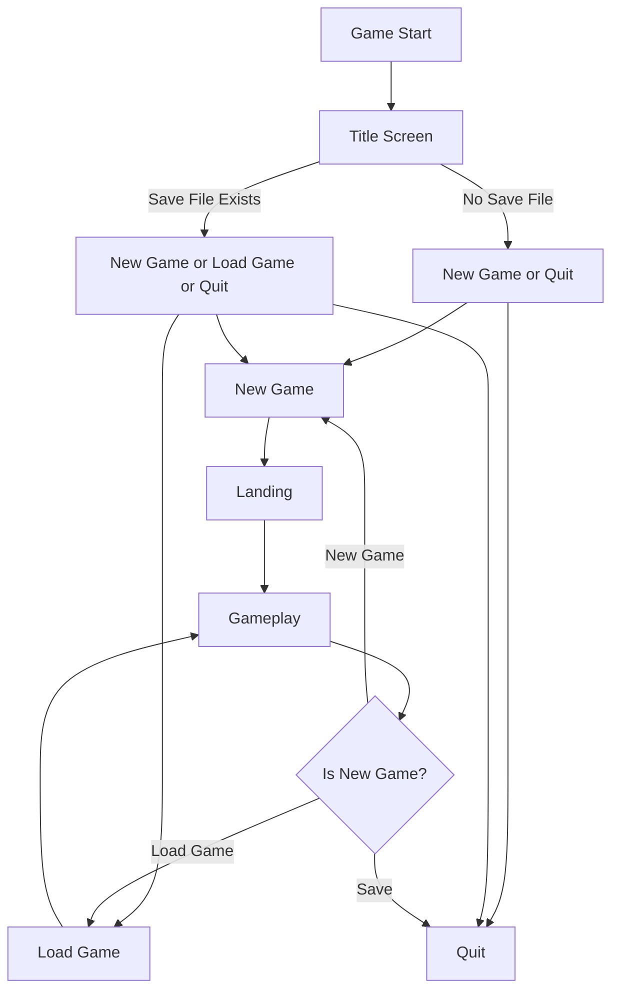
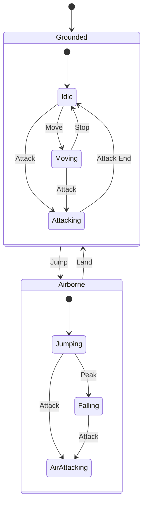
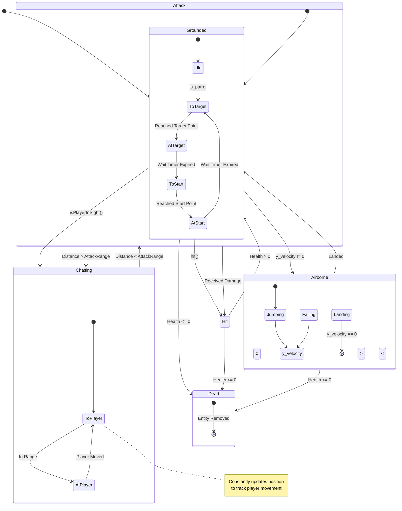
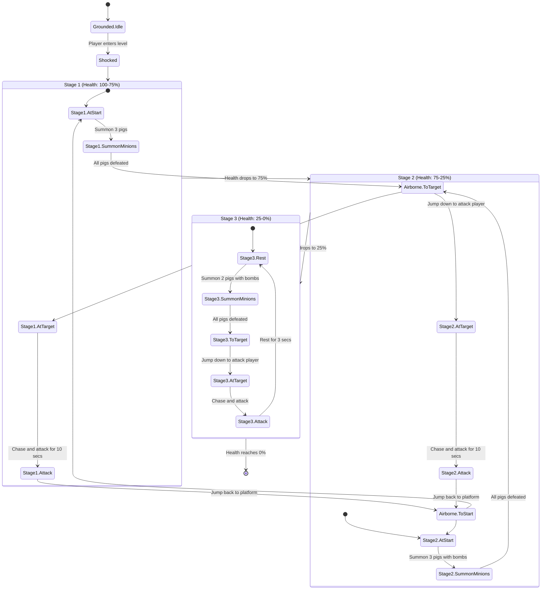

# Changelog

This document tracks significant changes, features, and fixes for each update.

## States Design

### Game States

### Player States

### Enemy States

### Boss(King-Pig) States

## Checkpoints

### 09/20/2024

#### Added

- Implemented camera control for dynamic views
- Created gravity simulation
- Established collision detection:
  - Rectangle visualization for collision zones
  - Debug information for collision and gravity
- Enabled level switching functionality
- Added basic enemy entities

#### Fixed

- Resolved player movement inconsistencies

### 10/04/2024

#### Added

- Defined strategy for player-enemy interaction
- Introduced enemy patrol behaviors
- Created interactive entities: door and chest
- Added basic UI elements, including a health bar
- Integrated background music (BGM)
- Added sound effects (SFX) for attacks
- Developed a scoring system with collectible coins

#### Changed

- Offset animations for health bar updates

#### Fixed

- Corrected enemy animation errors

### 10/11/2024

#### Added

- Designed main game screens: title, landing, and gameplay
- Developed level transition animations
- Defined hitbox logic
- Implemented interactions between player and enemies (attack logic)
- Added interactions for coins and doors

#### Changed

- Updated debugging information for collision handling
- Restructured UI module
- Enhanced gravity calculations

#### Fixed

- Addressed level transition issues
- Resolved `love.graphics.setColor()` interference with animation layers
- Fixed corner tiles rendering bug
- Improved enemy patrol to prevent falling
- Adjusted enemy image `offset_x`
- Corrected enemy animation flipping issues

### 10/18/2024

#### Added

- Added player-enemy interaction (damage logic)
- Implemented knockback effect on enemies

### 10/25/2024

#### Added

- Enabled game state saving and loading
- Preserved entity status across level transitions
- Saved player status across sessions
- Added quit button to main menu

#### Changed

- Made `Enemy` class extendable for future enemy types

### 11/01/2024

#### Added

- Item drops from defeated enemies
- Enemy chases player behaviors
- Enemy attack behaviors
- Enemy shows dialogue before actions
- Player dead state
- Gameover Screen
- Dynamic patrol route adjustments for enemies

#### Changed

- Improved enemy patrol to account for unreachable destinations

#### Fixed

- Resolve door collision issues
- Adjust hitbox logic for consistent enemy collision handling

### 11/08/2024

#### Added

- Invisible door for better level flow control
- Boss fight encounter
- Boss moves: summon minions
- Bomb

#### Changed

- Enemy can jump when it needs to

### 11/15/2024

#### Added

Invisible door for better level flow control
Boss fight encounter
Boss moves: summon minions

- [ ] Power-ups and experience points (EXP)
- [ ] Settings menu for in-game options

#### Changed

- [ ] Enhanced tileset rules

#### Fixed
